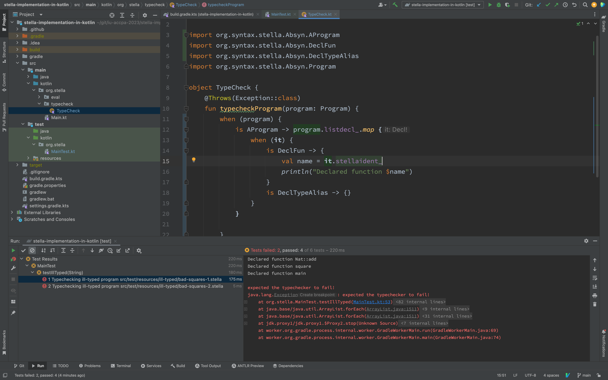

# stella-implementation-in-kotlin
Template for an implementation of Stella in Kotlin.

## How to pass tests
They are added in folder `src/test/resources/...`. They are added as the default tests, so you just need to start org.stellasql.stella.MainKt and the tests will be run.
For build just use `./gradlew build`. The main additions for now are in TypeChecker.kt and Output.kt

## Some notes
For now this program throws an exception if the type checker fails. This is not the desired behaviour, but the tester class was written in a way that it expects an exception to be thrown. Hope this will be changed in the future.

This typechecker checks the following nodes:

    AProgram
    DeclFun (only function name, one parameter, return type, and return expression)
    TypeBool, TypeNat, and TypeFun
    boolean expressions: ConstTrue, ConstFalse, If
    anonymous functions: Abstraction
    function application: Application
    natural number expressions: ConstInt(0), Succ, Pred, NatRec
    variables: Var

